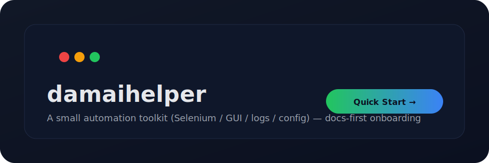

<p align="center">
  
</p>

> 说明：本仓库提供基于浏览器自动化的学习/研究示例，用于理解 Web 自动化、GUI 工具封装、日志与配置管理等工程实践。
> **请在遵守目标平台服务条款与当地法律法规的前提下使用。**

<p align="center">
  <a href="#快速开始">快速开始</a> ·
  <a href="#功能概览">功能概览</a> ·
  <a href="#项目结构">项目结构</a> ·
  <a href="#常见问题（faq）">FAQ</a> ·
  <a href="#贡献指南">贡献</a>
</p>

---

## ✨ 项目亮点

- **上手简单**：提供一键运行脚本与基础配置
- **可视化操作**：包含 GUI 入口（`GUI.py`）
- **日志可追踪**：运行日志输出到 `logs/`
- **依赖明确**：`requirements.txt` 固定版本，便于复现实验环境

> 如果你觉得这个项目对你有帮助，欢迎点一个 ⭐ Star 支持作者。

---

## 快速开始

### 1) 环境要求

- Windows 10/11（仓库内含 `chromedriver.exe`，默认面向 Windows）
- Python 3.x（建议 3.8+）
- Google Chrome（版本需与 chromedriver 匹配）

### 2) 安装依赖

```bash
pip install -r requirements.txt
```

### 3) 运行

#### 方式 A：一键运行（Windows）

双击：`win一件运行.bat`

#### 方式 B：直接运行脚本

```bash
python ticket_script.py
```

#### 方式 C：启动 GUI

```bash
python GUI.py
```

> 提示：如遇到驱动/浏览器版本不匹配，请先更新 Chrome 或替换对应版本的 `chromedriver.exe`。

---

## 功能概览

- 浏览器自动化（Selenium）
- 可选的移动端自动化依赖（Appium client，具体能力以代码为准）
- 定时/调度能力（APScheduler）
- 图片处理/识别依赖（Pillow + pytesseract，具体使用方式以代码为准）

---

## 配置说明

仓库包含 `config/` 目录，用于存放运行时配置（不同脚本读取方式可能不同，请以实际代码为准）。

建议你在本地创建/维护：

- `config/*.json` 或 `config/*.ini`
- 不要把个人敏感信息提交到仓库

---

## 项目结构

```text
.
├── GUI.py
├── ticket_script.py
├── requirements.txt
├── chromedriver.exe
├── config/
├── scripts/
├── logs/
└── *.html
```

---

## 常见问题（FAQ）

### Q1：运行时报错 `chromedriver` 版本不匹配？

A：确认你的 **Chrome 主版本号** 与 `chromedriver.exe` 主版本号一致。不一致时：

- 更新 Chrome 到匹配版本，或
- 下载对应版本的 chromedriver 替换仓库内的 `chromedriver.exe`

### Q2：`pip install` 很慢/失败？

A：可以使用国内镜像源（例如清华源）重试。

### Q3：日志在哪里？

A：默认在 `logs/` 目录（若代码中有自定义路径，以代码为准）。

---

## 贡献指南

欢迎 PR，让项目更易用、更稳定。

建议贡献方向：

- 文档完善（README、FAQ、截图、使用说明）
- 依赖升级与兼容性修复
- 更清晰的错误提示与日志

提交流程：

1. Fork 本仓库
2. 新建分支：`feat/docs-readme`
3. 提交变更并发起 Pull Request

---

## 免责声明

本仓库仅用于学习与研究目的。使用者需自行评估并承担使用风险，作者与贡献者不对任何直接或间接损失负责。
