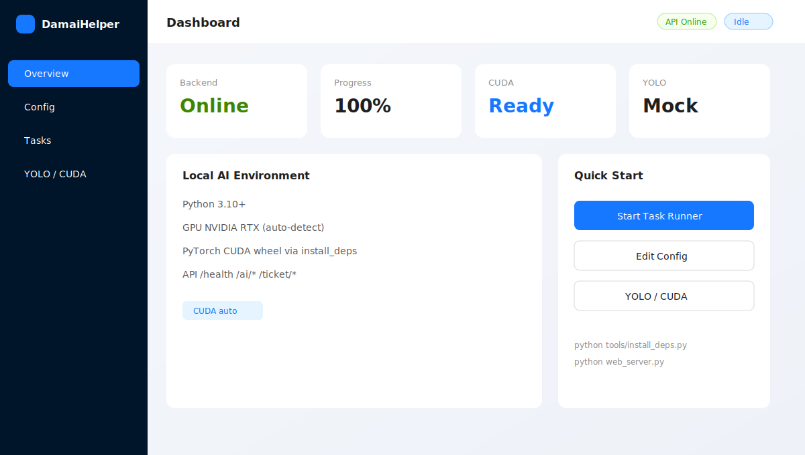
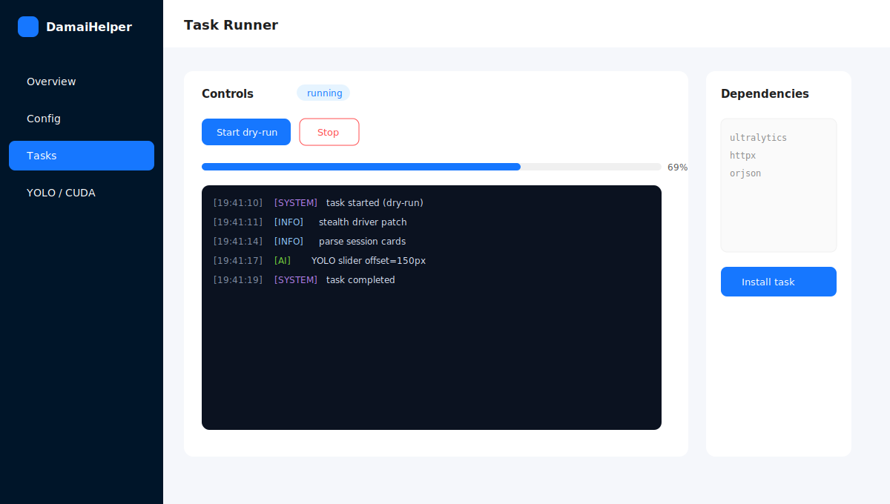
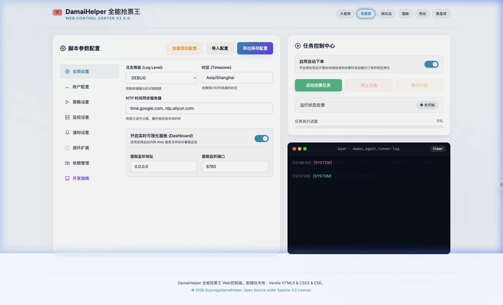
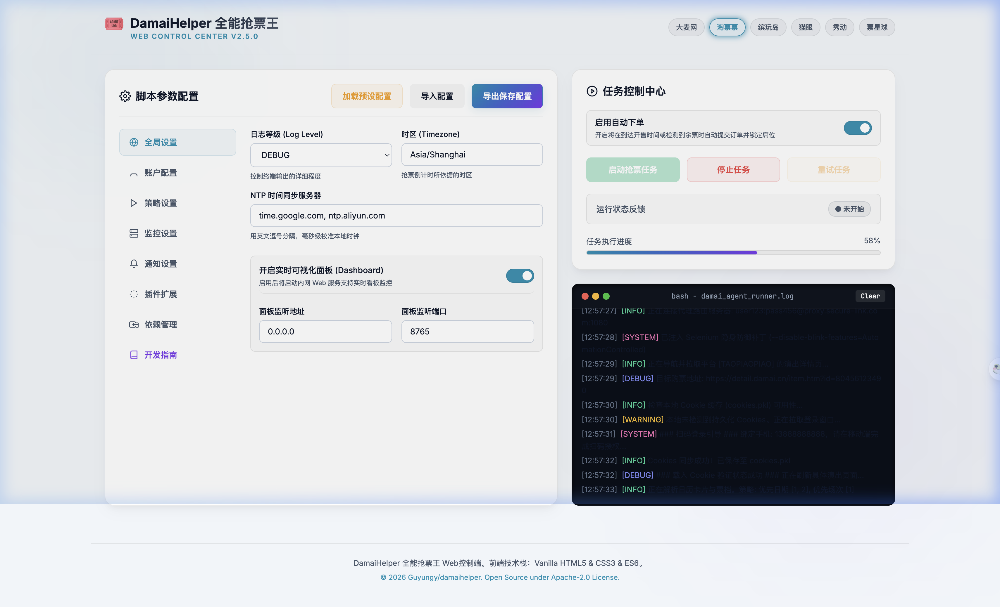

<div align="center">

# 🎟️ DamaiHelper

**多平台票务自动化 · Web 控制台 · 本机 YOLO/CUDA 逻辑层**

面向学习与联调的抢票助手骨架：配置 → 任务编排 → 日志回传 → AI 滑块接口。  
**不保证真实抢票效果**，默认 dry-run 跑通逻辑。

<br/>


<br/><br/>

[功能特性](#-功能特性) · [快速开始](#-快速开始) · [界面预览](#-界面预览) · [API](#-api-一览) · [项目结构](#-项目结构) · [常见问题](#-常见问题)

</div>

---

## ✨ 功能特性

| 模块 | 说明 |
|------|------|
| **Ant Design 控制台** | `web-ui/`：总览 / 配置 / 任务编排 / YOLO·CUDA |
| **REST 后端** | `web_server.py` 同源托管前端 + `/api/*` |
| **任务编排** | `scripts/task_runner.py` 阶段流、可停止、增量日志 |
| **本机 AI** | CUDA 探测 + Ultralytics YOLO（无权重自动 mock） |
| **一键安装** | `tools/install_deps.py` 按 GPU 装 CUDA 版 torch |
| **旧版兼容** | 无 `web-ui/dist` 时回退 `web/index.html` |

---

## 🚀 快速开始

### 环境

- Windows 10/11 或 macOS  
- Python **3.10+**（本机可 3.14）  
- 可选：NVIDIA GPU + 驱动（RTX 系列）、Node.js 18+（构建前端）

### 方式 A：一键脚本（推荐）

**Windows**

```bat
win一键运行.bat
```

**macOS / Linux**

```bash
chmod +x mac_一键运行.sh
./mac_一键运行.sh
```

脚本会：安装 Python 依赖 →（有 npm 时）构建 `web-ui` → 启动 `web_server.py` → 打开浏览器。

### 方式 B：手动

```bash
# 1) 依赖（含本机 CUDA torch 探测）
python tools/install_deps.py

# 2) 前端构建（可选，用于 Ant Design）
cd web-ui && npm install && npm run build && cd ..

# 3) 启动控制台
python web_server.py
```

浏览器打开：**http://localhost:8765/**

| 入口 | 地址 |
|------|------|
| 控制台首页 | http://localhost:8765/ |
| 健康检查 | http://localhost:8765/api/health |
| AI 状态 | http://localhost:8765/api/ai/status |

开发前端（热更新）：

```bash
python web_server.py          # 终端 1
cd web-ui && npm run dev      # 终端 2 → http://localhost:5173
```

> `pip install -r requirements.txt` **不含** torch，避免误装 CPU 轮子。GPU 栈请用 `tools/install_deps.py`。

---

## 🖥️ 界面预览

以下为仓库内 **本地 SVG 示意图**（不依赖 shields / 外链图床，GitHub 渲染稳定）。

### 1. 总览（GPU / 后端状态）



### 2. 任务编排（日志 + 进度）



### 3. 经典 Web 面板截图（仓库内 PNG）

| 配置主面板 | 运行中日志 |
|:---:|:---:|
|  |  |

> 若截图路径失效，可直接运行 `python web_server.py` 在浏览器查看实机界面。  
> 重新生成示意图：`python tools/gen_readme_assets.py`

---

## 📡 API 一览

完整约定见 [web/docs/integration_guide.md](web/docs/integration_guide.md)。

| 方法 | 路径 | 说明 |
|------|------|------|
| GET | `/api/health` | 服务与任务快照 |
| GET/POST | `/api/config` | 读写 `config/config.json` |
| POST | `/api/ticket/start` | 启动编排（默认 `dry_run: true`） |
| POST | `/api/ticket/stop` | 停止当前任务 |
| GET | `/api/ticket/logs?offset=` | 增量日志 / 进度 |
| POST | `/api/dependencies/install` | 依赖逻辑任务 |
| GET | `/api/ai/status` | GPU / torch / YOLO 环境 |
| POST | `/api/ai/load` | 加载权重（可 `allow_download`） |
| POST | `/api/ai/detect` | 目标检测 |
| POST | `/api/ai/slider` | 滑块偏移求解 |

CLI 演练：

```bash
python -m scripts.main
python -m scripts.main --accounts
python -m scripts.main --schedule
```

---

## 📁 项目结构

```text
damaihelper/
├── web_server.py              # HTTP 服务 + REST + 静态托管
├── tools/
│   ├── install_deps.py        # 一键依赖（CUDA torch / YOLO / 前端）
│   └── gen_readme_assets.py   # 生成本地 README 图
├── web-ui/                    # Ant Design + React + Vite
│   └── src/pages/             # 总览 / 配置 / 任务 / AI
├── web/
│   ├── index.html             # 旧版面板（兼容）
│   ├── images/                # 截图 PNG
│   └── docs/integration_guide.md
├── scripts/
│   ├── task_runner.py         # 任务编排
│   ├── config_manager.py      # 配置读写
│   ├── yolo_engine.py         # YOLO 封装
│   ├── device_probe.py        # CUDA 探测
│   └── ...
├── config/                    # 配置（勿提交隐私）
├── models/                    # YOLO 权重目录
├── docs/assets/               # README 本地徽章与示意图
├── win一键运行.bat
├── mac_一键运行.sh
└── requirements.txt
```

---

## 🧩 技术栈

- **后端**：Python 3 · 标准库 `http.server` · Selenium（可选）  
- **前端**：React 18 · Ant Design 5 · Vite 6 · TypeScript  
- **AI**：PyTorch（CUDA 轮子优先）· Ultralytics YOLO · OpenCV  
- **工程**：GitHub Actions auto-merge · REST 前后端联调  

---

## ❓ 常见问题

**Q: README 里 badges / star-history 裂图？**  
已改为仓库内 `docs/assets/*.svg`，不再依赖 `img.shields.io` / `api.star-history.com`（部分网络会 403）。

**Q: 打开首页仍是旧版 HTML？**  
先构建前端：`cd web-ui && npm install && npm run build`，再启动 `web_server.py`。

**Q: CUDA 不可用 / torch 是 +cpu？**  

```bash
python tools/install_deps.py
# 或手动：
python -m pip uninstall -y torch torchvision torchaudio
python -m pip install --upgrade --force-reinstall torch torchvision torchaudio --index-url https://download.pytorch.org/whl/cu128
```

**Q: chromedriver 版本不匹配？**  
Selenium 4.6+ 可自动管理驱动；也可自行放置匹配的 `chromedriver`。本项目默认 dry-run，不强制真浏览器。

**Q: 日志在哪？**  
任务日志经 `/api/ticket/logs` 推到前端；历史文件见 `logs/`。

**Q: 能真实抢到票吗？**  
不能保证。本仓库以**代码逻辑与联调**为主，请遵守各平台服务条款与当地法律法规。

---

## 🤝 贡献

欢迎 PR：

1. Fork → 新建分支  
2. 提交改动  
3. 打开 PR（仓库已启用 **auto-merge / squash**；可用标签 `wip` / `do-not-merge` 阻止自动合并）

推荐方向：Ant Design 体验、编排阶段、YOLO 权重与文档、依赖安装兼容性。

---

## ⚠️ 免责声明

本项目仅供个人学习、研究与技术交流，**不鼓励**用于商业盈利或违反平台协议的行为。

使用过程中产生的账号风险、票务纠纷、经济或法律后果由使用者自行承担。作者与贡献者不对任何直接或间接损失负责。

请遵守大麦 / 淘票票 / 缤玩岛等平台规则及相关法律法规。

---

<div align="center">

**DamaiHelper 为预期能力说明，不代表真实抢票成功率。**

若本项目对你有帮助，欢迎 Star 支持维护。

</div>
