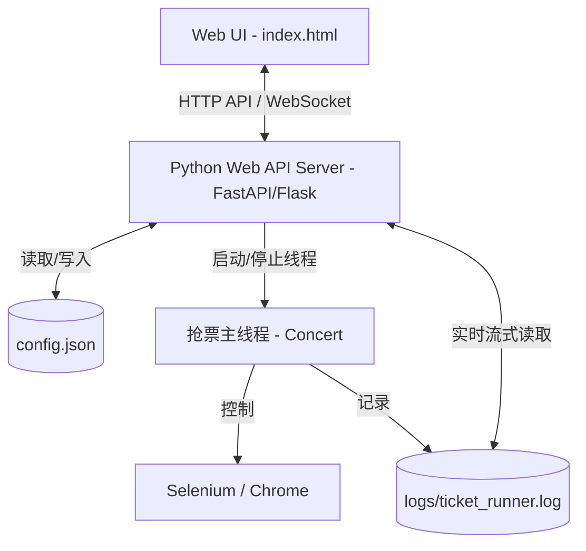

# DamaiHelper 前后端集成实现方案

本指南旨在说明如何将当前的 Web UI 前端与 Python 后台抢票脚本（`ticket_script.py` / `GUI.py`）进行集成，实现真正的实机运行控制。

---

## 1. 架构设计

集成架构采用 **前后端分离 / 嵌入式后台** 设计：
- **前端 (Frontend)**：由 `index.html` 提供的单页 Web 界面，负责参数配置、任务控制、日志渲染。
- **后端 (Backend)**：使用 Python 开发轻量级 HTTP 服务（推荐 **FastAPI** 或 **Flask**），监听用户在界面配置的端口（如 `8765`），负责读取/写入本地 `config.json`，调度自动化抢票线程，控制 Selenium 浏览器。



---

## 2. 后端 API 接口规范

为了使前端能够控制实机，Python 后端需要实现以下 RESTful API 接口：

### 2.1 获取配置
- **请求**：`GET /api/config`
- **响应**：直接返回本地 `config/config.json` 的 JSON 数据。

### 2.2 保存配置
- **请求**：`POST /api/config`
- **请求体**：配置项 JSON 数据。
- **响应**：`{"status": "success", "message": "配置保存成功"}`。并在后台写入 `config/config.json`。

### 2.3 执行依赖自检与安装
- **请求**：`POST /api/dependencies/install`
- **请求体**：`{"packages": ["package1", "package2"]}`
- **响应**：`{"status": "started", "task_id": "dep_install_01"}`
- **说明**：后台异步调用子进程（如 `pip install`）并重定向日志到管道中，前端可通过 WebSocket 或日志轮询接口获取安装进度。

### 2.4 获取依赖安装报告
- **请求**：`GET /api/dependencies/report`
- **响应**：纯文本 (Text) 格式的 pip 安装输出报告。

### 2.5 启动抢票任务
- **请求**：`POST /api/ticket/start`
- **请求体**：无（或传入当前临时配置）
- **说明**：后台解析最新配置，实例化 `Concert` 类并开启独立子线程运行抢票逻辑，开始写入日志文件（如 `logs/current_run.log`）。

### 2.6 停止抢票任务
- **请求**：`POST /api/ticket/stop`
- **说明**：强制终止抢票线程，调用 `driver.quit()` 关闭 Chrome 浏览器实例，清理驱动进程。

### 2.7 实时状态与日志同步
- **请求**：`GET /api/ticket/status`
- **响应**：
  ```json
  {
    "status": "running", 
    "progress": 65, 
    "logs": [
      "[12:30:15] [INFO] 正在刷新具体演出页面...",
      "[12:30:16] [INFO] 选择购票数: 2 张..."
    ]
  }
  ```
- **更佳方案**：使用 **WebSocket**（`ws://localhost:8765/api/ws/logs`）或 **SSE (Server-Sent Events)** 实现双向或单向日志长连接实时推流，避免前端频繁轮询。

---

## 3. 后端最小可行性实现 (FastAPI 示例)

你可以创建一个 `web_server.py` 来运行此接口，实现与前端的桥接：

```python
import asyncio
import os
import json
from fastapi import FastAPI, WebSocket
from fastapi.middleware.cors import CORSMiddleware
from pydantic import BaseModel

app = FastAPI()

# 允许跨域以便 index.html 直连
app.add_middleware(
    CORSMiddleware,
    allow_origins=["*"],
    allow_credentials=True,
    allow_methods=["*"],
    allow_headers=["*"],
)

CONFIG_PATH = "config/config.json"

@app.get("/api/config")
def get_config():
    if os.path.exists(CONFIG_PATH):
        with open(CONFIG_PATH, "r", encoding="utf-8") as f:
            return json.load(f)
    return {"error": "Config not found"}

@app.post("/api/config")
def save_config(config: dict):
    os.makedirs(os.path.dirname(CONFIG_PATH), exist_ok=True)
    with open(CONFIG_PATH, "w", encoding="utf-8") as f:
        json.dump(config, f, ensure_ascii=False, indent=2)
    return {"status": "success"}

# 日志 WebSocket 推送通道
@app.websocket("/api/ws/logs")
async def websocket_endpoint(websocket: WebSocket):
    await websocket.accept()
    # 读取本地 log 文件变化并推送
    log_file = "logs/current_run.log"
    if not os.path.exists(log_file):
        open(log_file, "w").close()
        
    with open(log_file, "r", encoding="utf-8") as f:
        f.seek(0, 2) # 移至文件末尾
        while True:
            line = f.readline()
            if not line:
                await asyncio.sleep(0.5)
                continue
            await websocket.send_text(line.strip())
```

---

## 4. 前端接口集成步骤

在 `index.html` 的 JavaScript 部分，我们已经预留了 API 请求的基础框架。具体接入时：
1. **统一接口前缀**：
   ```javascript
   const port = document.getElementById('dashboard_port').value || 8765;
   const host = document.getElementById('dashboard_host').value || 'localhost';
   const API_BASE = `http://${host}:${port}/api`;
   ```
2. **重写行动函数**：
   - 将 `saveAndDownloadConfig()` 改为通过 `fetch(API_BASE + '/config')` 发送 POST。
   - 将 `startTicketingSim()` 和 `stopTicketingSim()` 分别改为向 `/ticket/start` 和 `/ticket/stop` 发送请求。
   - 建立 WebSocket 监听服务，从 `/ws/logs` 管道中接收 `stdout` 输出并调用 `appendLog()` 实时渲染至界面控制台。
